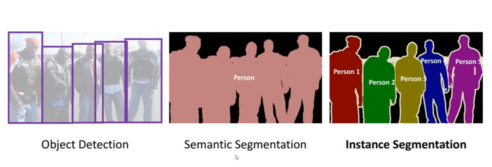

# unet_from_scratch
Implementaion of U-Net architecture for Semantic Segmentation

Semantic Segmentaion : Consider an image and make a bounding box around each object, this will be Object Detection.
                       If we paint the pixel around every obejct, it is semantic segmentation where every pixel represents either an object or non-object/background, UNET is designed to do this.
                       One step further is Instance Segmentaion.

Link to Original Paper : https://arxiv.org/abs/1505.04597 : Authors came up with this for Biomedical Image Segmentaion.

Part on Left is Encoder(Downsampling) and Right Part is Decoder(Upsampling) and Concatenation of feature maps or right and left is responsible for localization information (Bottom Part)k

The architecture consists of a contracting path to capture context and a symmetric expanding path that enables precise localization.
The typical use of convolutional networks is on classification tasks, where the output to an image is a single class label. However, in many visual tasks, especially in biomedical image processing, the desired output should include localization, i.e., a class label is supposed to be assigned to each pixel.

Training data in number of patches is much larger than number of training images.

